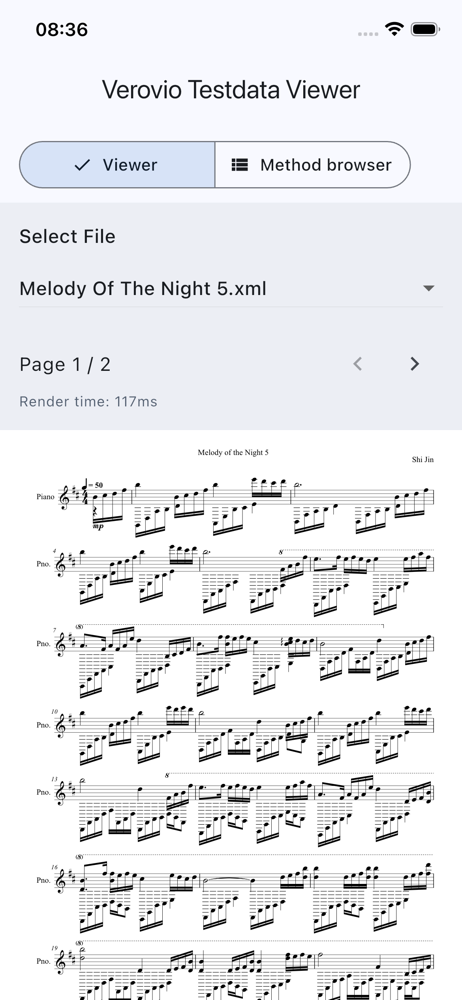

# verovio_flutter

**在 Flutter 应用里渲染高质量五线谱 —— 从 MEI / MusicXML / ABC / Humdrum / PAE 直接生成 SVG。**

[](LICENSE)
[]()
[]()

Language: [English](README.md) | [中文](README_CN.md)

<p align="center">
  
</p>

`verovio_flutter` 是一个 Flutter FFI 插件，把 [Verovio](https://www.verovio.org/) —— MEI 社区、RISM、Music Encoding Initiative 都在用的开源乐谱排版引擎 —— 原生集成进 Android 和 iOS App。**不依赖服务器、不依赖 WebView、不依赖网络**，纯本地排版。

## 为什么用它

- **真正的乐谱排版**：连音线、跨小节连线、装饰音、歌词、多声部、自动换页等都按出版级标准处理，不是简单画音符。
- **完全离线**：通过 FFI 直接调用原生 C++ 库，没有 HTTP、没有 JS 桥接。
- **多种输入格式**：MEI、MusicXML、Humdrum、ABC、Plaine & Easie。
- **输出 SVG**：矢量图任意缩放，可嵌入自己的 Widget、导出 PDF，也可以自行后处理（高亮、动画等）。
- **不会卡 UI**：`VerovioService.spawn` 在独立 Isolate 中跑排版，主线程零阻塞。
- **体积可控**：Android 启用 `--split-per-abi` 后单架构增量仅约 7 MB。

## 安装

```yaml
dependencies:
  verovio_flutter: ^0.1.1
```

## 快速上手

```dart
import 'package:flutter/material.dart';
import 'package:flutter_svg/flutter_svg.dart';
import 'package:verovio_flutter/verovio_flutter.dart';

Future<void> main() async {
  WidgetsFlutterBinding.ensureInitialized();

  // 1. 解包 Verovio 字体与资源（首次启动一次即可）。
  final resourcePath = await VerovioResourceManager.ensureVerovioAssetsReady();

  // 2. 启动排版 Isolate。
  final service = await VerovioService.spawn(resourcePath: resourcePath);

  // 3. 喂入 MEI / MusicXML / ABC / Humdrum 数据。
  service.loadData('''<mei xmlns="http://www.music-encoding.org/ns/mei">
    <music><body><mdiv><score><section/></score></mdiv></body></music>
  </mei>''');

  // 4. 取出任意一页 SVG 并显示。
  final svg = service.renderToSvg(1);

  runApp(MaterialApp(
    home: Scaffold(
      appBar: AppBar(title: const Text('verovio_flutter')),
      body: SvgPicture.string(svg),
    ),
  ));
}
```

完整可运行示例见 [`example/`](example) 目录。

## 平台支持

| 平台 | 最低版本 | 架构 |
|------|----------|------|
| Android | API 21 | arm64-v8a / x86_64 |
| iOS | 13.0 | arm64（真机）/ arm64 + x86_64（模拟器）|

## 体积

| 组成 | 大小 |
|------|------|
| `android/src/main/jniLibs` | 14 MB |
| `ios/Frameworks/VerovioFFI.xcframework` | 8.6 MB |
| `assets/verovio_data`（字体 + Schema）| 11 MB |
| **打包总计** | **33.6 MB** |

Android 使用 `--split-per-abi` 后的单架构安装增量：**约 6.8 MB**（`arm64-v8a`）/ **7.2 MB**（`x86_64`），未计 APK 压缩差异。

## API 文档

完整的 `VerovioService` 接口（渲染选项、翻页、MIDI 导出、time-map 等）请见 [`doc/api.md`](doc/api.md)。

## 版本对应

| verovio_flutter | Verovio 上游 |
|-----------------|--------------|
| 0.1.0 | `version-2.7.1-10372-g8100cb396` (`8100cb39604d40102a9c2ce75719136f3fb52a77`) |
| 0.1.1 | `version-6.2.1` (`8d42439dc9231f6c87779287b542febcb3d609b3`) |

## 许可证

LGPL-3.0。Verovio 本身就是 LGPL-3.0，任何派生作品必须遵守相同的条款。在遵守 LGPL 动态链接条款的前提下，可以在闭源 App 中使用。

## 维护者指南

<details>
<summary>构建与同步命令</summary>

- 拉取代码（含子模块）：`git clone --recurse-submodules https://github.com/csa8820/verovio_flutter`
- 重新构建 Android `.so`：`bash tool/build_android_so.sh`
- 重新构建 iOS `.xcframework`：`bash tool/build_ios_xcframework.sh`
- 同步上游 Verovio 源码：`bash tool/sync_verovio_sources.sh`

</details>

## 鸣谢

底层引擎来自 RISM Digital Center 的 [Verovio](https://github.com/rism-digital/verovio)。本插件只提供 Flutter / FFI 胶水代码，所有排版能力都属于他们。
