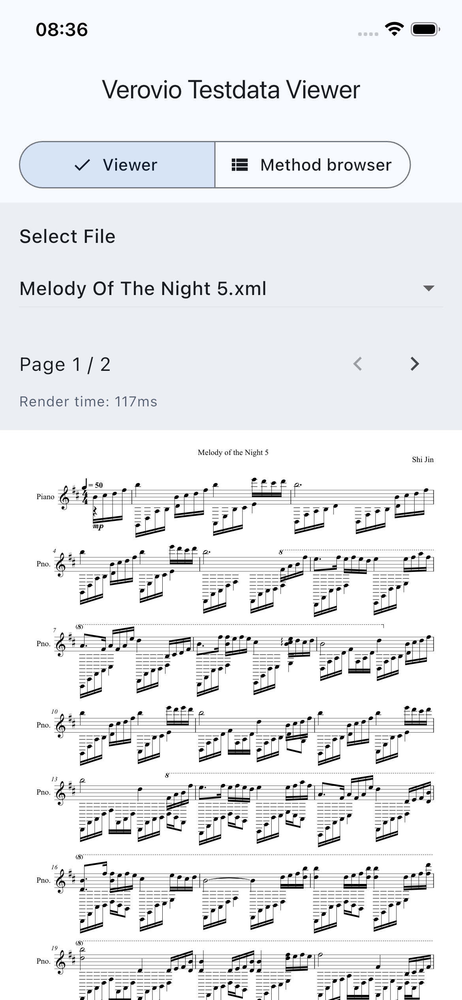

# verovio_flutter

**在 Flutter 应用里渲染高质量五线谱 —— 从 MEI / MusicXML / ABC / Humdrum / PAE 直接生成 SVG。**

[](LICENSE)
[]()
[]()

Language: [English](README.md) | [中文](README_CN.md)

<p align="center">
  
</p>

`verovio_flutter` 是一个 Flutter FFI 插件，把 [Verovio](https://www.verovio.org/) —— MEI 社区、RISM、Music Encoding Initiative 都在用的开源乐谱排版引擎 —— 原生集成进 Android 和 iOS App。**不依赖服务器、不依赖 WebView、不依赖网络**，纯本地排版。

## 为什么用它

- **真正的乐谱排版**：连音线、跨小节连线、装饰音、歌词、多声部、自动换页等都按出版级标准处理，不是简单画音符。
- **完全离线**：通过 FFI 直接调用原生 C++ 库，没有 HTTP、没有 JS 桥接。
- **多种输入格式**：MEI、MusicXML、Humdrum、ABC、Plaine & Easie。
- **输出 SVG**：矢量图任意缩放，可嵌入自己的 Widget、导出 PDF，也可以自行后处理（高亮、动画等）。
- **不会卡 UI**：`VerovioAsyncService` 在独立 Isolate 中跑排版,主线程零阻塞。
- **体积可控**：Android 启用 `--split-per-abi` 后单架构增量仅约 7 MB。

## 安装

```yaml
dependencies:
  verovio_flutter: ^0.3.1
```

## 快速上手

```dart
import 'package:flutter/material.dart';
import 'package:verovio_flutter/verovio_flutter.dart';

Future<void> main() async {
  WidgetsFlutterBinding.ensureInitialized();

  // 1. 解包 Verovio 字体与资源（首次启动一次即可）。
  final resourcePath = await VerovioResourceManager.ensureVerovioAssetsReady();

  // 2. 启动持有 Toolkit 的 worker Isolate。
  final service = await VerovioAsyncService.spawn(resourcePath: resourcePath);

  // 3. 喂入 MEI / MusicXML / ABC / Humdrum 数据。
  await service.loadData('''<mei xmlns="http://www.music-encoding.org/ns/mei">
    <music><body><mdiv><score><section/></score></mdiv></body></music>
  </mei>''');

  // 4. 取出任意一页 SVG 并显示。
  final svg = await service.renderToSvg(1);

  // 用任意 SVG 渲染方案显示 `svg` 即可
  // (例如 flutter_svg、jovial_svg、WebView,或自己实现的渲染器)。
  print(svg);
}
```

`VerovioAsyncService` 把每个 FFI 调用都派发到独立的 worker isolate,主线程不会被阻塞。请统一使用这一异步入口。

完整可运行示例见 [`example/`](example) 目录。

### 可选页面缓存

如果同一页会反复渲染，可以用 `VerovioPageCache` 缓存 SVG 字符串：

```dart
final cache = VerovioPageCache(capacity: 32);
final svg = await cache.getOrRender(
  data: mei,
  optionsJson: '{}',
  pageNo: 1,
  render: () => service.renderToSvg(1),
);
```

## 平台支持

| 平台 | 最低版本 | 架构 | 说明 |
|------|----------|------|------|
| Android | API 21 | arm64-v8a / x86_64 | 原生 FFI |
| iOS | 13.0 | arm64（真机）/ arm64 + x86_64（模拟器）| 原生 FFI |
| Web | 所有现代浏览器 | N/A | 通过 Web Worker 运行 WASM |
| 微信小程序 | — | N/A | 通过 inline 后端运行 WASM（无 Worker）|

### Web 支持（WASM）

`verovio_flutter` 完全支持 **Flutter Web**，采用 WebAssembly 技术。**公共 API 在各平台保持兼容** —— 你的代码在移动端和 Web 上都能用，无需改写，少数 Web 专用方法会以 no-op 形式提供。

**核心特性：**
- 在 Web Worker 中渲染 SVG（不阻塞主线程）
- 全部 38 个 Verovio API 方法（渲染、MIDI、time-map、hit_map、ZIP/MXL 加载、编辑操作等）
- `renderPageWithHitMap()` 和 `hitTestPoint()` 支持命中测试
- `VerovioPageCache` 页面缓存
- 完全本地，无需后端服务器或 HTTP

**构建 Web 版本：**

1. 构建 Web Worker 与 Flutter 应用：
   ```bash
   cd path/to/verovio_flutter
   bash tool/build_web.sh
   ```
2. 运行或直接启服务：
   ```bash
   # 方式 1：flutter run
   flutter run -d chrome

   # 方式 2：手动启服务
   python3 -m http.server --directory example/build/web 8000
   # 然后打开 http://localhost:8000
   ```

**在你自己的应用中使用（Web）：**

本包会自行创建 Web Worker 并加载 WASM toolkit，**无需**在 `index.html` 里引入任何
bootstrap `<script>`。你只需把以下两个文件放到应用的 web 根目录（从本包的 `web/` 复制）：

```
web/
├── verovio_worker.dart.js              # 编译后的 Verovio worker
└── verovio/
    └── verovio-toolkit-wasm.js         # 官方 Verovio WASM toolkit
```

worker 的 `dart compile js` 已由 `tool/build_web.sh` 自动完成，并会把
`verovio_worker.dart.js` 复制进 `example/web/`。在你自己的应用中，把上述两个文件复制到
你的 `web/` 目录即可（这样 `flutter run -d chrome` 和 `flutter build web` 都能取到）。

**可选配置。** 若资源放在非默认位置，可在 `web/index.html` 中、Flutter 启动前设置全局配置：

```html
<script>
  window.verovioFlutterConfig = {
    workerUrl: 'verovio_worker.dart.js',           // 默认值
    wasmUrl: 'verovio/verovio-toolkit-wasm.js',    // 默认值，相对 worker 解析
  };
</script>
```

> 在 Web 上，`VerovioAsyncService.spawn(...)` 的 `resourcePath` 会被忽略——字体与资源
> 已内嵌在 WASM 模块中。传任意非空字符串即可满足跨平台 API。

**版本对齐：**

| 组件 | 版本 | 说明 |
|------|------|------|
| 原生（Android/iOS）| Verovio 6.2.1 | 从[上游 tag](https://github.com/rism-digital/verovio) 构建 |
| Web（WASM）| Verovio 6.2.0 | 官方 [npm 包](https://www.npmjs.com/package/verovio) —— 行为与原生 6.2.1 等价 |

> **为什么 Web 上用 6.2.0？** Verovio 官方 npm 包只发布了 6.2.0 的 WASM；没有 6.2.1 的 JS/WASM 版本。emscripten 输出（6.2.0 vs 6.2.1）在行为上是一致的。

**Web 平台已知限制：**

以下方法在 Web 上是 **no-op**（返回占位值或无操作）：
- `setScale()` / `getScale()` —— WASM 工具包不提供对应方法
- `setResourcePath()` / `getResourcePath()` —— 字体已内嵌于 WASM；资源路径无用
- `setInputFrom()` / `setOutputTo()` —— 文件 I/O 对 WASM 不适用
- `spawn()` —— Web 透明处理初始化

所有其他方法（渲染、MIDI、命中测试、编辑等）的行为与原生实现完全一致。

**性能参考：**
- SVG 渲染：每页 50–200 ms（取决于乐谱复杂度）
- hit_map 生成：包含在渲染时间内；由 `VerovioPageCache` 缓存
- 内存：WASM 堆由浏览器管理；`dispose()` 释放 Worker 资源
- 大乐谱：在浏览器 DevTools Memory 标签观察堆使用模式

### 微信小程序支持

Web 后端同样可以运行在**微信小程序**的逻辑层中。小程序逻辑层没有 Web Worker，
本包会自动检测并切换到 **inline 后端**（`worker_client_inline_web.dart`），在同一线程上
运行 toolkit —— 无需改动任何 API。

**检测逻辑：**
- 若宿主设置了 `window.verovioFlutterConfig.forceInline = true`，使用 inline 后端。
- 否则，若存在 `WXWebAssembly` 全局变量（微信小程序逻辑层），使用 inline 后端。
- 普通浏览器环境则使用标准 Web Worker 后端。

**已内置的小程序资源：**

官方 `verovio-toolkit-wasm.js` 把 WASM 二进制以巨大的 base64 字符串内嵌其中，
会超出小程序分包体积限制。本包已直接提供瘦身后的胶水文件和 brotli 压缩的二进制，
无需自行构建：

```
web/verovio/
├── verovio-weapp.js      # 瘦身后的胶水（WASM 改为外部加载）
└── verovio.wasm.br       # brotli 压缩的 WASM 二进制
```

把这两个文件复制到你的小程序工程，并在加载胶水前把 `wx.__verovioWasmPath`
指向 `.wasm.br` 资源即可。

## 体积

| 组成 | 大小 |
|------|------|
| `android/src/main/jniLibs` | 14 MB |
| `ios/Frameworks/VerovioFFI.xcframework` | 14.8 MB |
| `assets/verovio_data`（字体 + Schema）| 11.4 MB |
| **打包总计** | **40.2 MB** |

Android 使用 `--split-per-abi` 后的单架构安装增量：**约 6.8 MB**（`arm64-v8a`）/ **7.2 MB**（`x86_64`），未计 APK 压缩差异。

> 说明：iOS 这次改成了更完整的 `.xcframework` 打包流程，所以体积会上升。

## API 文档

完整的 `VerovioAsyncService` 接口（渲染选项、翻页、MIDI 导出、time-map 等）请见 [`doc/api.md`](doc/api.md),该文档同时概述 `VerovioResourceManager` 和 `VerovioPageCache`。

## 常见问题

- **`spawn()` 抛 `ArgumentError`**：请确认 `resourcePath` 是 `VerovioResourceManager.ensureVerovioAssetsReady()` 返回的绝对路径。
- **`loadData()` 后抛 `VerovioException`**：优先查看 `exception.log`，Verovio 通常会给出解析或排版错误原因。
- **输出为空 / `pageCount == 0`**：确认输入确实是支持的谱面格式，而且数据不是空字符串。
- **pub.dev 分数没立即变化**：重新发布后需要等待 pub.dev 重新分析包。

## 版本对应

| verovio_flutter | Verovio 上游 |
|-----------------|--------------|
| 0.1.0 | `version-2.7.1-10372-g8100cb396` (`8100cb39604d40102a9c2ce75719136f3fb52a77`) |
| 0.1.1 | `version-6.2.1` (`8d42439dc9231f6c87779287b542febcb3d609b3`) |
| 0.1.2 | `version-6.2.1` (`8d42439dc9231f6c87779287b542febcb3d609b3`) |
| 0.1.3 | `version-6.2.1` (`8d42439dc9231f6c87779287b542febcb3d609b3`) |
| 0.1.4 | `version-6.2.1` (`8d42439dc9231f6c87779287b542febcb3d609b3`) |
| 0.1.6 | `version-6.2.1` (`8d42439dc9231f6c87779287b542febcb3d609b3`) |
| 0.2.0 | `version-6.2.1` (`8d42439dc9231f6c87779287b542febcb3d609b3`) |
| 0.2.1 | `version-6.2.1` (`8d42439dc9231f6c87779287b542febcb3d609b3`) |
| 0.3.0 | `version-6.2.1` (`8d42439dc9231f6c87779287b542febcb3d609b3`) |
| 0.3.1 | `version-6.2.1` (`8d42439dc9231f6c87779287b542febcb3d609b3`) |

## 许可证

LGPL-3.0。Verovio 本身就是 LGPL-3.0，任何派生作品必须遵守相同的条款。在遵守 LGPL 动态链接条款的前提下，可以在闭源 App 中使用。

## 维护者指南

<details>
<summary>构建与同步命令</summary>

- 拉取代码（含子模块）：`git clone --recurse-submodules https://github.com/csa8820/verovio_flutter`
- 重新构建 Android `.so`：`bash tool/build_android_so.sh`
- 重新构建 iOS `.xcframework`：`bash tool/build_ios_xcframework.sh`
- 同步上游 Verovio 源码：`bash tool/sync_verovio_sources.sh`

</details>

## 鸣谢

底层引擎来自 RISM Digital Center 的 [Verovio](https://github.com/rism-digital/verovio)。本插件只提供 Flutter / FFI 胶水代码，所有排版能力都属于他们。
